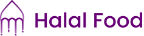

# 
  Welcome to TA Halal Food  

## 📃 About Halal Food

Halal Food adalah sebuah aplikasi berbasis web yang menyediakan informasi mengenai makanan halal. Aplikasi ini dirancang untuk membantu pengguna dalam mencari makanan halal yang sesuai dengan kebutuhan mereka. Aplikasi ini menyediakan informasi mengenai restoran atau tempat makan yang menyediakan makanan halal, menu makanan halal yang tersedia, serta informasi mengenai bahan-bahan yang digunakan dalam makanan tersebut.

 
 

## 👩‍💻 Our Team

UIUX Designer and Frontend Developer

####  **[ERSA NUR MAULANA](https://github.com/ersanurm)**

####  **[SOYA KARERRA](https://github.com/soyakarerra)**

Backend Developer

####  **[ANNISA RISMA AQILAH](https://github.com/annisarisma)**

####  **[ALFA SAFIRA](https://github.com/alfasafira)**

 
 

## 🔧 Technologies & Tools

 
 

## ⚒️ Build With

## About Laravel

Laravel is a web application framework with expressive, elegant syntax. We believe development must be an enjoyable and creative experience to be truly fulfilling. Laravel takes the pain out of development by easing common tasks used in many web projects, such as:

- [Simple, fast routing engine](https://laravel.com/docs/routing).
- [Powerful dependency injection container](https://laravel.com/docs/container).
- Multiple back-ends for [session](https://laravel.com/docs/session) and [cache](https://laravel.com/docs/cache) storage.
- Expressive, intuitive [database ORM](https://laravel.com/docs/eloquent).
- Database agnostic [schema migrations](https://laravel.com/docs/migrations).
- [Robust background job processing](https://laravel.com/docs/queues).
- [Real-time event broadcasting](https://laravel.com/docs/broadcasting).

Laravel is accessible, powerful, and provides tools required for large, robust applications.

## Learning Laravel

Laravel has the most extensive and thorough [documentation](https://laravel.com/docs) and video tutorial library of all modern web application frameworks, making it a breeze to get started with the framework.

If you don't feel like reading, [Laracasts](https://laracasts.com) can help. Laracasts contains over 2000 video tutorials on a range of topics including Laravel, modern PHP, unit testing, and JavaScript. Boost your skills by digging into our comprehensive video library.

## License

The Laravel framework is open-sourced software licensed under the [MIT license](https://opensource.org/licenses/MIT).

## List Project

- User
- Kontributor
- Superadmin
